# CibiNet SSDS — Mermaid Diagrams

This file contains all Mermaid JS diagrams for the CibiNet Software System Design Specification (SSDS-002). Each diagram includes its unique ID, the SSDS section it belongs to, and a placement description. When finalizing the document in Word/Google Docs, embed the rendered diagram image at the indicated location.

---

## COLLAB-01 — System Collaboration Diagram: Donation Claiming Flow

**Belongs in:** Section 10 — System-Wide Design Decisions (opening paragraph, before 10.1)
**Placement:** Insert as "Figure 10.0 — System Collaboration Diagram: Donation Claiming Flow"
**Description:** Shows the object-level collaboration for the primary system flow — a Recipient claiming a donation. Objects are shown with their class names (instance:Class). Numbered messages show execution order. This is the most representative cross-component interaction in CibiNet.

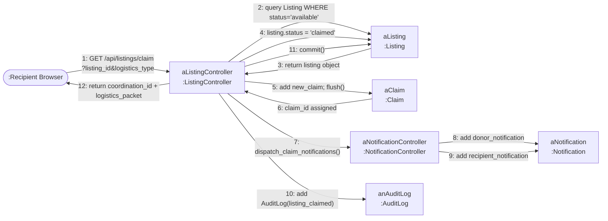

---

## ARCH-01 — Component Architecture Diagram

**Belongs in:** Section 10.1 — Software Component Architectural Design
**Placement:** Insert as "Figure 10.1 — CibiNet Component Architecture"
**Description:** Decomposition of CibiNet into its primary components across three layers (Frontend, Backend, Data) plus external integrations. Arrows show dependency direction. The Frontend communicates exclusively through the API client. The Background Scheduler is a daemon thread inside the WSGI process.

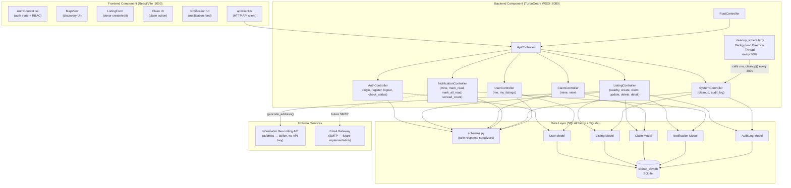

---

## CLASS-01 — AuthComponent Class Diagram

**Belongs in:** Section 11.1.1 — Software Unit Detailed Design (AuthComponent subsection)
**Placement:** Insert as "Figure 11.1.1-A — AuthComponent Class Diagram"
**Description:** Shows AuthController's dependencies: it reads/writes tg_session (interface), queries the User model, and serializes responses through UserSchema. Browser is the boundary class.

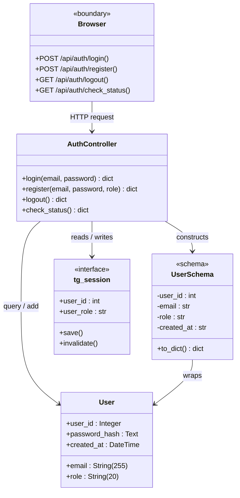

---

## CLASS-02 — ListingComponent Class Diagram

**Belongs in:** Section 11.1.1 — Software Unit Detailed Design (ListingComponent subsection)
**Placement:** Insert as "Figure 11.1.1-B — ListingComponent Class Diagram"
**Description:** The largest component. ListingController handles all listing and claim operations. Three schemas serve different response shapes. geocode_address() is a module-level utility function.

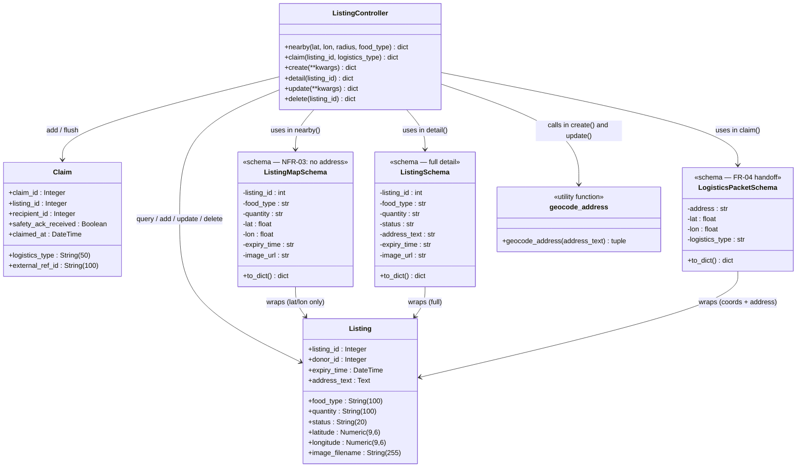

---

## CLASS-03 — NotificationComponent Class Diagram

**Belongs in:** Section 11.1.1 — Software Unit Detailed Design (NotificationComponent subsection)
**Placement:** Insert as "Figure 11.1.1-C — NotificationComponent Class Diagram"
**Description:** dispatch_claim_notifications() is a module-level function called by ListingController. NotificationController handles read-state management. All responses go through NotificationSchema.

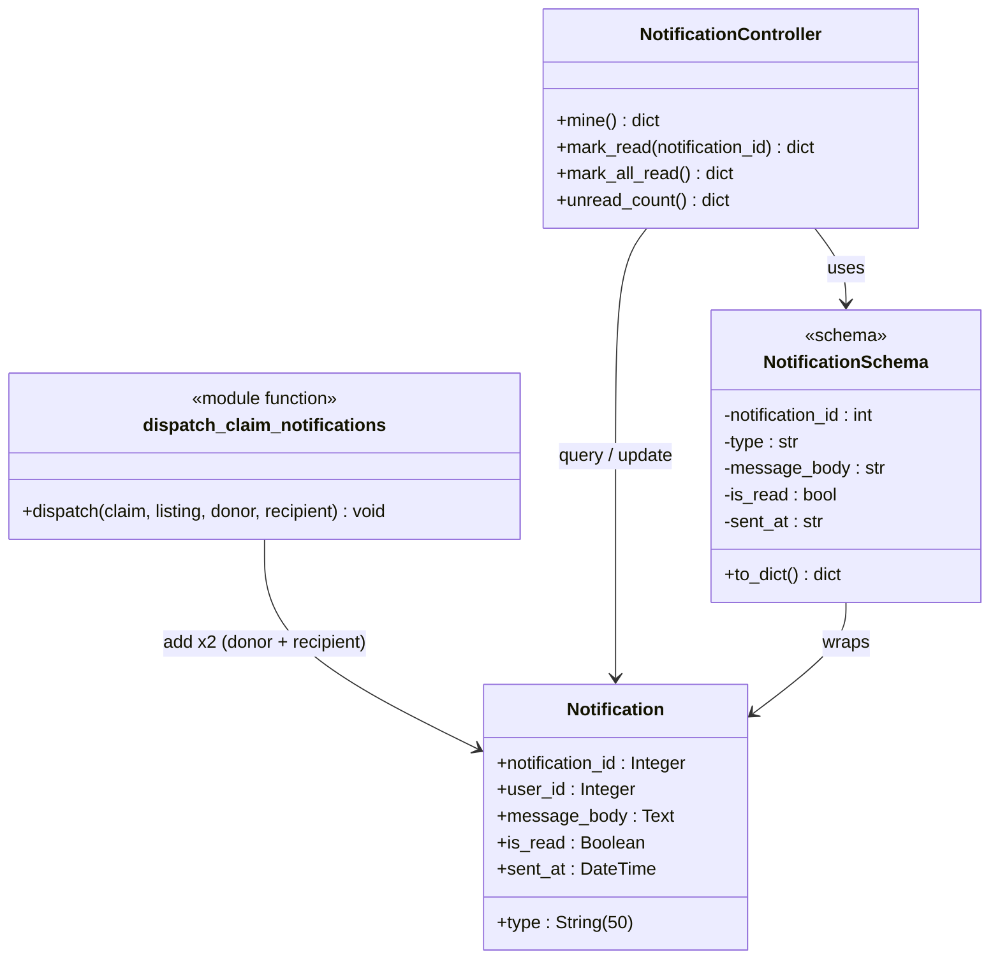

---

## CLASS-04 — SystemComponent Class Diagram

**Belongs in:** Section 11.1.1 — Software Unit Detailed Design (SystemComponent subsection)
**Placement:** Insert as "Figure 11.1.1-D — SystemComponent Class Diagram"
**Description:** run_cleanup() uses an isolated SQLAlchemy session (thread-safe). cleanup_scheduler() is the daemon thread entry point. SystemController exposes manual triggers.

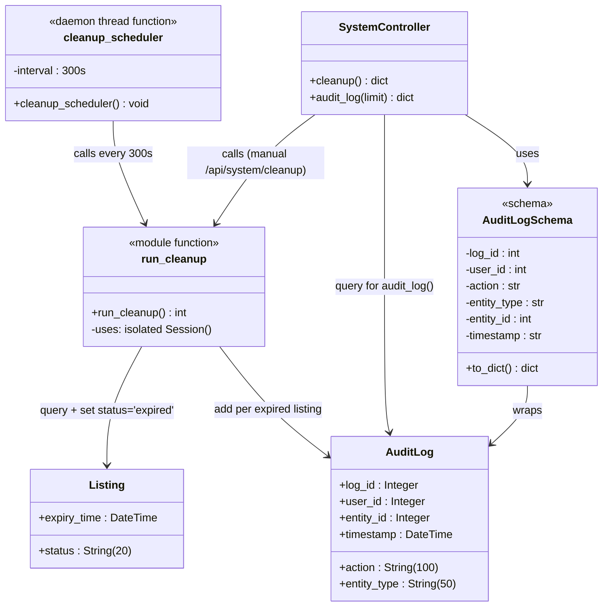

---

## SEQ-01 — Sequence Diagram: UC01 User Authentication

**Belongs in:** Section 11.3.1 — Sequence Diagrams (first diagram)
**Placement:** Insert as "Figure 11.3.1-A — Sequence Diagram: UC01 User Authentication"
**Description:** Login flow from browser through AuthController. Password is SHA-256 hashed client-side before comparison. Session cookie is set on success. Interface classes (Browser, tg_session) appear on the sequence.

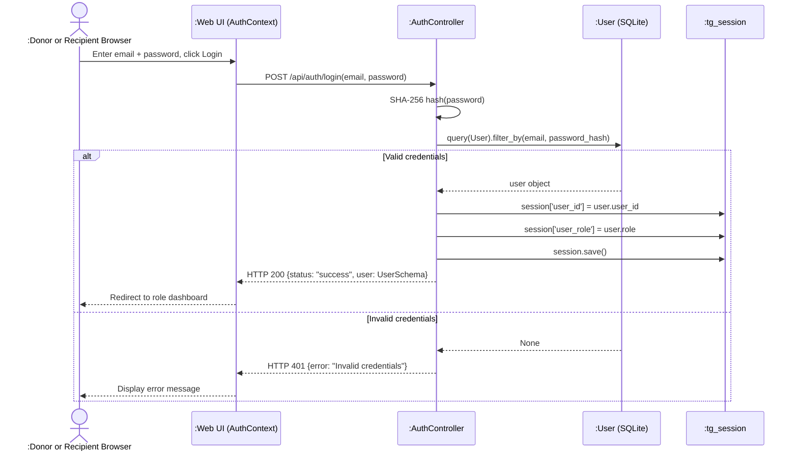

---

## SEQ-02 — Sequence Diagram: UC02 Post Surplus Food

**Belongs in:** Section 11.3.1 — Sequence Diagrams
**Placement:** Insert as "Figure 11.3.1-B — Sequence Diagram: UC02 Post Surplus Food"
**Description:** Donor creates a listing. Geocoding contacts Nominatim; on failure, a default NYC coordinate is used. session.flush() assigns listing_id before the AuditLog is written.

```mermaid
sequenceDiagram
    actor Donor as :Donor Browser
    participant UI as :Web UI (ListingForm)
    participant LC as :ListingController
    participant GEO as :Nominatim Geocoding API
    participant LM as :Listing (SQLite)
    participant AL as :AuditLog (SQLite)

    Donor->>UI: Submit form (food_type, quantity, address_text, hours_until_expiry, image)
    UI->>LC: POST /api/listings/create(kwargs)
    LC->>LC: Check tg_session role == 'Donor'
    LC->>LC: Validate food_type, quantity, address_text present
    LC->>GEO: geocode_address(address_text)
    alt Geocoding succeeds
        GEO-->>LC: (lat, lon)
    else Geocoding fails / timeout
        GEO-->>LC: Exception caught
        LC->>LC: default lat=40.7128, lon=-74.0060
    end
    LC->>LC: expiry_dt = utcnow + timedelta(hours)
    LC->>LC: save_upload(image) → image_filename
    LC->>LM: add(new_listing); flush()
    LM-->>LC: listing_id assigned
    LC->>AL: add(AuditLog action='listing_created', entity_id=listing_id)
    LC->>LM: commit()
    LC-->>UI: HTTP 200 {status: "success", listing_id, expires_at}
    UI-->>Donor: Display success confirmation
```

---

## SEQ-03 — Sequence Diagram: UC03 Geographic Discovery

**Belongs in:** Section 11.3.1 — Sequence Diagrams
**Placement:** Insert as "Figure 11.3.1-C — Sequence Diagram: UC03 Geographic Discovery"
**Description:** Recipient queries available listings using a bounding-box calculation (radius/111 degrees per km). ListingMapSchema deliberately omits address_text (NFR-03). Results return within 3 seconds (NFR-01).

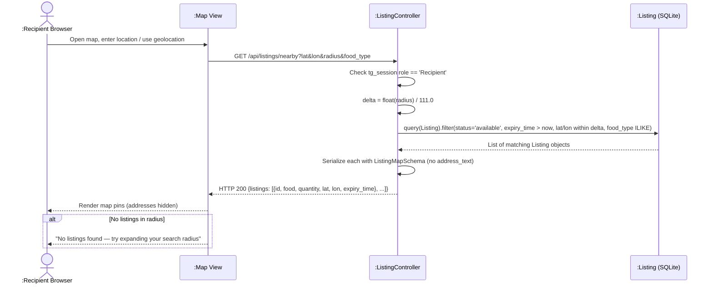

---

## SEQ-04 — Sequence Diagram: UC04 Initiate Logistics Handoff

**Belongs in:** Section 11.3.1 — Sequence Diagrams
**Placement:** Insert as "Figure 11.3.1-D — Sequence Diagram: UC04 Logistics Handoff"
**Description:** Triggered as the final return step within UC05. After a successful claim commit, the system generates a LogisticsPacket exposing full address and coordinates. For third_party logistics_type, this packet is intended for forwarding to an external delivery API.

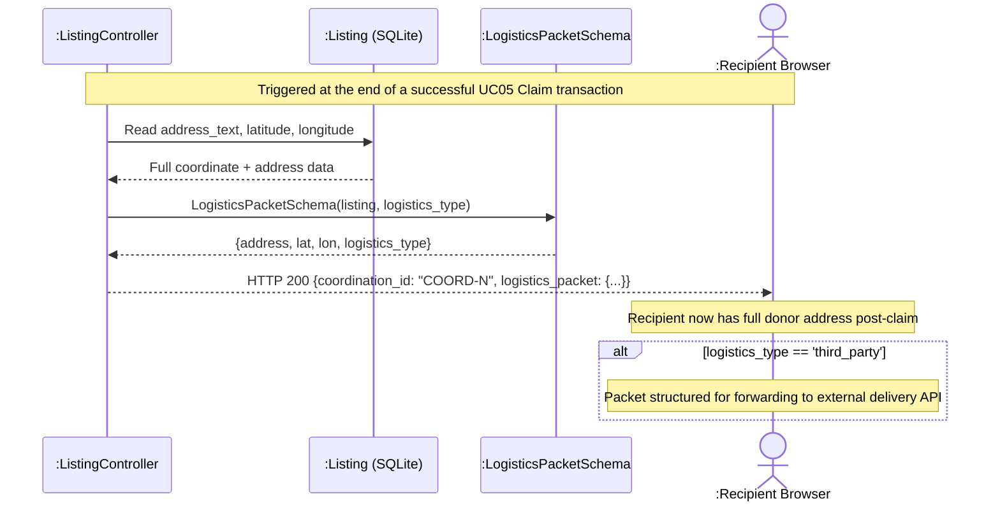

---

## SEQ-05 — Sequence Diagram: UC05 Donation Claiming

**Belongs in:** Section 11.3.1 — Sequence Diagrams
**Placement:** Insert as "Figure 11.3.1-E — Sequence Diagram: UC05 Donation Claiming"
**Description:** The core atomic claim-lock transaction. Listing is queried with status='available' filter; if another user already claimed it, the query returns None and a 409 is returned. All writes (status update, claim, notifications, audit log) are committed atomically.

```mermaid
sequenceDiagram
    actor Recipient as :Recipient Browser
    participant UI as :Web UI
    participant LC as :ListingController
    participant LM as :Listing (SQLite)
    participant CM as :Claim (SQLite)
    participant NC as dispatch_claim_notifications()
    participant NM as :Notification (SQLite)
    participant AL as :AuditLog (SQLite)

    Recipient->>UI: Click "Claim" button on listing
    UI->>LC: GET /api/listings/claim?listing_id&logistics_type
    LC->>LC: Check tg_session role == 'Recipient'
    LC->>LC: Validate logistics_type in {self_pickup, third_party}
    LC->>LM: query(Listing).filter_by(listing_id, status='available')
    alt Listing is available
        LM-->>LC: listing object
        LC->>LM: listing.status = 'claimed'
        LC->>CM: add(new_claim); flush()
        CM-->>LC: claim_id assigned
        LC->>NC: dispatch_claim_notifications(claim, listing, donor, recipient)
        NC->>NM: add(Notification type='claim_received' for donor)
        NC->>NM: add(Notification type='claim_confirmed' for recipient)
        LC->>AL: add(AuditLog action='listing_claimed', entity_id=listing_id)
        LC->>LM: commit()
        LC-->>UI: HTTP 200 {status:"success", coordination_id, logistics_packet}
        UI-->>Recipient: Show coordination_id and pickup info
    else Listing already claimed or expired
        LM-->>LC: None
        LC-->>UI: HTTP 409 {error: "Item unavailable"}
        UI-->>Recipient: Show conflict error
    end
```

---

## SEQ-06 — Sequence Diagram: UC06 Automated Safety Pruning

**Belongs in:** Section 11.3.1 — Sequence Diagrams
**Placement:** Insert as "Figure 11.3.1-F — Sequence Diagram: UC06 Automated Safety Pruning"
**Description:** Background daemon thread calls run_cleanup() every 300 seconds. run_cleanup() uses an isolated SQLAlchemy session (not the shared web-request session) for thread safety. Manual trigger also available via /api/system/cleanup.

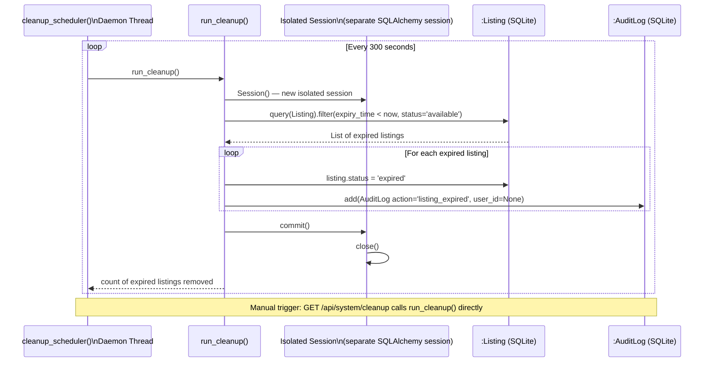

---

## SEQ-07 — Sequence Diagram: UC07 Dispatch Fulfillment Notification

**Belongs in:** Section 11.3.1 — Sequence Diagrams
**Placement:** Insert as "Figure 11.3.1-G — Sequence Diagram: UC07 Dispatch Fulfillment Notification"
**Description:** dispatch_claim_notifications() is called within the UC05 claim transaction after flush(). This ensures claim_id exists before building the Coordination ID. Both Notification records are staged but not committed — ListingController owns the final commit.

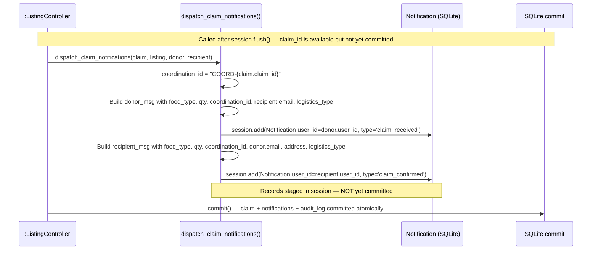

---

## STATE-01 — State Diagram: Listing Lifecycle

**Belongs in:** Section 11.3.2 — State Diagrams
**Placement:** Insert as "Figure 11.3.2-A — State Diagram: Listing Lifecycle"
**Description:** The Listing entity has three possible states. Transition to 'claimed' is atomic via the claim-lock transaction. Transition to 'expired' is autonomous via the background scheduler. Both terminal states remove the listing from the discovery map.

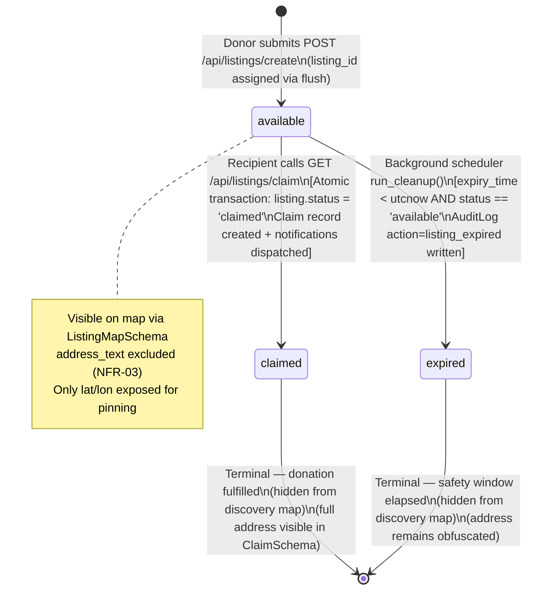

---

## STATE-02 — State Diagram: Notification Read State

**Belongs in:** Section 11.3.2 — State Diagrams
**Placement:** Insert as "Figure 11.3.2-B — State Diagram: Notification Read State"
**Description:** Notification records are created with is_read=False by dispatch_claim_notifications(). They transition to is_read=True when the user explicitly marks them read.

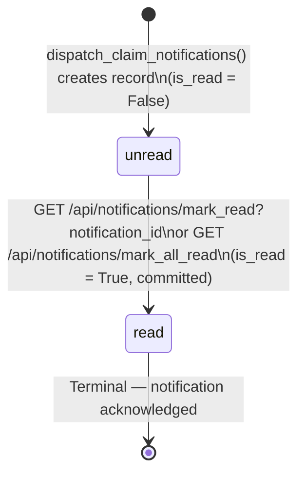

---

## ACT-01 — Activity Diagram: Donation Claiming Process

**Belongs in:** Section 11.3.3 — Activity Diagrams
**Placement:** Insert as "Figure 11.3.3-A — Activity Diagram: Donation Claiming Process"
**Description:** End-to-end activity flow for UC05 (Donation Claiming), including all guard conditions, the atomic database transaction, and the exception rollback path.

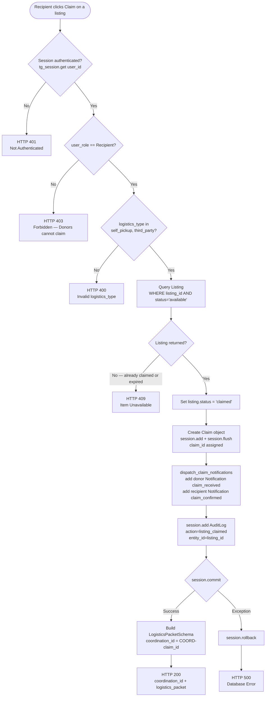

---

## DEPLOY-01 — Deployment Architecture Diagram

**Belongs in:** Section 12.1 — Physical Deployment Architecture Diagram
**Placement:** Insert as "Figure 12.1 — CibiNet Physical Deployment Architecture"
**Description:** Side-by-side view of the development and production deployment environments. The development environment uses the Vite dev server proxy. Production targets an Nginx reverse proxy with HTTPS termination in front of the same TurboGears WSGI process.

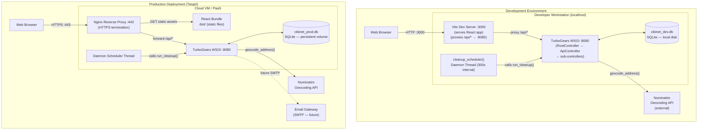
